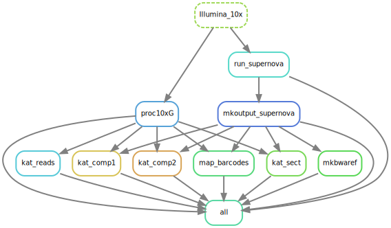
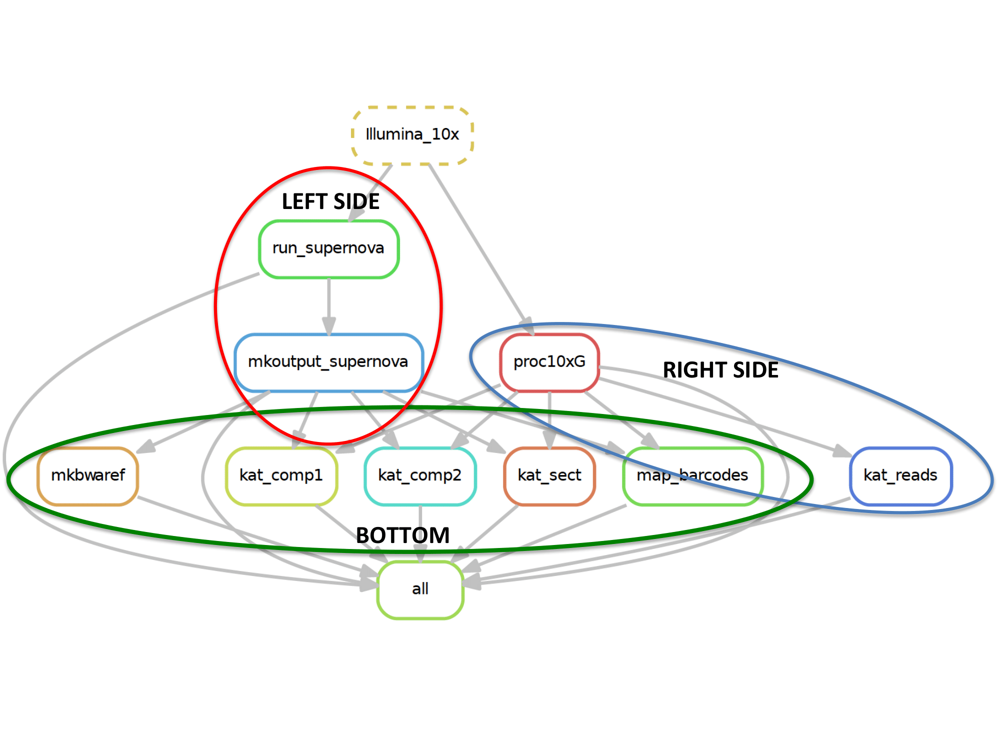

# Running UCD Bioinformatics Supernova Pipeline with Snakemake

##  HOW TO CALL THE SNAKEMAKE FILE (GENERAL):

1.  `snakemake -s snakemake.py **RULE_NAME**`
2.  Files needed: `snakemake.py`, `templates/cluster.json`, `templates/keith.json`
3.  Be sure to specify `running_locally` in the `template/keith.json` file. 
    - If `running_locally` == 'True':
        + `templates/cluster.json` is not needed if running locally only.
        + don't need to worry about the sbatch parameters in the `templates/keith.json` file
        + Follow rules under **RUNNING LOCALLY** below.
    - Else if `running_locally` == 'False':
        + be sure to set all sbatch parameters in the `templates/keith.json` file
        + Follow rules under **RUNNING ON CLUSTER** below.
        
## RUNNING ON CLUSTER
***
1.  Left Side  
    - running_locally = "False", sbatch included in snakemake call and run supernova runs on that job and call sbatch for mkoutput (3x)
    - `snakemake -s snakemake.py --cluster-config templates/cluster.json --cluster "sbatch -J {cluster.ls.job-name} -N 
       {cluster.ls.n} -p {cluster.ls.partition} -t {cluster.ls.time} -m 
       {cluster.ls.mem} --output {cluster.ls.output} --error {cluster.ls.error} --mail-type 
       {cluster.ls.mail-type} --mail-user {cluster.ls.mail-user} --exclusive" left_side`

2.  Right Side
    - running_locally = "False", sbatch included in snakemake call and proc10xg runs on that job and call sbatch for kat reads (3x)
    - `snakemake -s snakemake.py --cluster-config templates/cluster.json --cluster "sbatch -J {cluster.rs.job-name} -N 
       {cluster.rs.n} -p {cluster.rs.partition} -t {cluster.rs.time} -n {cluster.rs.ntasks} -m 
       {cluster.rs.mem} --output {cluster.rs.output} --error {cluster.rs.error} --mail-type 
       {cluster.rs.mail-type} --mail-user {cluster.rs.mail-user}" right_side`

3.  Bottom 
    - running_locally = "False", no sbatch included in call or included (doesnt matter) all portions submitted as an sbatch
    - `snakemake -s snakemake.py bottom`
    
4.  Running 1 rule of interest?
    - running_locally = "False", 
    - All rules except `run_supernova` and `proc10xG`
        - `snakemake -s snakemake.py **RULE_NAME**`
    - `run_supernova`
        - Run number 1, except replace `left_side` with `run_supernova` at the end of the command. 
    - `proc10xG`
        - Run number 2, except replace `right_side` with `proc10xG` at the end of the command. 
    
***

 
 
***

## RUNNING LOCALLY (TODO)

***
1. All
    - running_locally = "True"
    - `snakemake -s snakemake.py all`

2. Left Side
    - running_locally = "True"
    - `snakemake -s snakemake.py all`
 
3. Right Side
    - running_locally = "True"
    - `snakemake -s snakemake.py all`
    
4. Bottom
    - running_locally = "True"
    - `snakemake -s snakemake.py all`    
    
5.  Running 1 rule of interest? (IDK ABOUT THIS QUITE YET)
    - running_locally = "True", no sbatch included in call
    - `snakemake -s snakemake.py **RULE_NAME**`
***

# TODO pick better names then Left and Right side since it changes when you make the graph ...haha